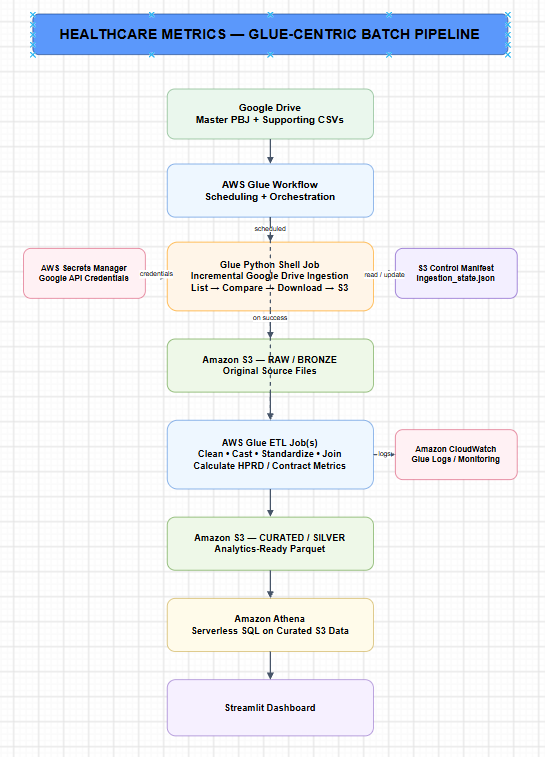

# CMS Nursing Home Staffing & Quality Analytics Pipeline

An end-to-end AWS data engineering project that ingests, transforms, analyzes, and visualizes CMS nursing-home staffing and quality data using AWS Glue, Amazon S3, Athena, and Streamlit.

---

## Project Overview

This project builds an automated analytics platform for U.S. nursing-home staffing and quality data.

The pipeline incrementally ingests CMS datasets from Google Drive, stores raw data in Amazon S3, transforms the data using AWS Glue, creates curated Parquet datasets, queries the analytical layer with Amazon Athena, and presents results through an interactive Streamlit dashboard.

The analytical focus is on the relationship between nursing staffing levels, contract labor dependency, CMS facility ratings, and resident utilization outcomes.

---

## Business Problem

Nursing-home operational and quality data is distributed across multiple CMS datasets with different structures and grains.

The goal of this project is to create a unified analytical platform that can answer questions such as:

- How much direct nursing care is provided per resident day?
- How does RN staffing differ across facilities and states?
- Which facilities rely more heavily on contract labor?
- How do staffing levels relate to CMS ratings?
- Are higher staffing levels associated with lower rehospitalization or emergency-department utilization?

---

## Architecture



```text
Google Drive
      |
      v
AWS Glue Workflow
      |
      v
Glue Python Shell Ingestion
      |
      v
Amazon S3 Raw / Bronze
      |
      v
AWS Glue Spark ETL
      |
      v
Amazon S3 Curated / Silver
      |
      v
Amazon Athena
      |
      v
Streamlit Dashboard


The pipeline uses AWS Glue Workflow for orchestration and scheduling.

Incremental ingestion state is maintained in Amazon S3.

Technology Stack
Layer	Technology
Source	Google Drive / CMS datasets
Ingestion	AWS Glue Python Shell
Orchestration	AWS Glue Workflow
Storage	Amazon S3
Transformation	AWS Glue / Apache Spark
Curated Format	Apache Parquet
Query Engine	Amazon Athena
Data Catalog	AWS Glue Data Catalog
Secrets	AWS Secrets Manager
Monitoring	Amazon CloudWatch
Dashboard	Streamlit
Languages	Python, SQL
Data Sources
Primary Dataset

CMS Payroll-Based Journal (PBJ) Daily Nurse Staffing — Q2 2024

The PBJ dataset contains daily staffing hours and resident census information for Medicare and Medicaid certified nursing homes.

The full Q2 2024 dataset contains approximately:

1.3 million daily facility records
14,564 facilities
91 reporting days
All U.S. states and territories
Supporting Datasets

The project also integrates:

CMS Nursing Home Provider Information
CMS Claims-Based Quality Measures

Provider information adds facility characteristics and CMS ratings.

Claims-based measures provide resident utilization outcomes including:

Risk-adjusted rehospitalization
Short-stay emergency department visits
Long-stay hospitalizations
Long-stay emergency department visits
End-to-End Data Flow
1. Incremental Ingestion

AWS Glue Python Shell connects to Google Drive using OAuth credentials stored in AWS Secrets Manager.

Each source file is identified using its Google Drive file ID and modification timestamp.

A state file stored in S3 records previously processed files so that unchanged files are skipped during subsequent workflow runs.

2. Raw Storage

Source files are stored in:

s3://healthcare-metrics-data/raw/

Major source areas include:

raw/pbj/
raw/supporting/
3. Data Transformation

AWS Glue Spark jobs clean and transform the raw datasets.

The main ETL jobs are:

PBJ staffing transformation
Provider information transformation
Quality claims transformation
Facility metrics enrichment
4. Curated Data

Processed datasets are stored as Parquet files in Amazon S3.

Examples:

curated/pbj_metrics/
curated/provider_info/
curated/quality_claims/
curated/facility_metrics/

The facility metrics dataset is partitioned by state to reduce Athena query scans.

5. Analytical Layer

Amazon Athena provides SQL access to the curated datasets.

Athena views create:

Facility-level staffing summaries
State-level staffing summaries
CMS facility rating summaries
Facility quality outcomes
Unified staffing and quality analytics
Staffing-quality correlation metrics
6. Dashboard

Streamlit queries Athena and presents:

National staffing KPIs
State comparisons
Facility rankings
Facility-level staffing metrics
CMS ratings
Quality outcomes
Daily staffing trends
Staffing versus quality analyses
Core Metrics
Total Direct HPRD

Total nursing hours provided by RN, LPN, and CNA staff divided by resident census.

Total Direct HPRD =
Total Direct Nursing Hours / Total Resident Days
RN HPRD
RN HPRD =
RN Nursing Hours / Total Resident Days
CNA HPRD
CNA HPRD =
CNA Nursing Hours / Total Resident Days
Contract Dependency %

Measures the proportion of direct-care nursing hours supplied by contract staff.

Contract Dependency % =
Contract Direct-Care Hours
/
Total Direct-Care Hours
* 100
Risk-Adjusted Rehospitalization Rate

CMS claims-based measure representing the percentage of short-stay residents rehospitalized after nursing-home admission.

Analytical Findings

The analysis shows a strong relationship between staffing levels and CMS ratings.

Facilities with higher direct-care HPRD generally have higher Overall and Staffing Ratings.

Average Staffing Rating increased from approximately:

1.91 stars for facilities below 3.0 HPRD
to
4.31 stars for facilities above 5.0 HPRD

Short-stay emergency-department utilization also declined across higher staffing groups.

However, relationships between staffing levels and adverse utilization outcomes are relatively weak at the individual-facility level.

For example, the correlation between Total HPRD and Staffing Rating is substantially stronger than correlations between Total HPRD and rehospitalization or hospital utilization.

RN staffing showed the most consistently negative relationship with adverse utilization outcomes among the staffing categories examined.

These findings demonstrate association rather than causation.

See:

Analytical Findings

Data Quality & Validation

Validation checks include:

Date-range validation
Facility-count validation
Duplicate-key detection
Negative staffing-hour detection
Census validation
Employee and contract staffing reconciliation
Join coverage analysis
Output row-count reconciliation

For the main facility enrichment join:

PBJ Facilities:       14,564
Matched Facilities:   14,547
Unmatched Facilities: 17
Join Coverage:        99.88%

The pipeline uses a left join so that unmatched PBJ facilities remain available for staffing analysis.

Design Decisions
Athena Instead of Redshift

Athena was selected because the workload is analytical, batch-oriented, and relatively low-frequency.

Using serverless Athena over Parquet datasets avoids the operational overhead and ongoing cost of maintaining a Redshift cluster.

Glue Workflow Instead of EventBridge + Lambda

AWS Glue Workflow handles scheduling and orchestration directly.

This reduces unnecessary infrastructure and keeps ingestion and ETL coordination within the same AWS service.

S3 State File Instead of DynamoDB

Incremental ingestion state is small and changes only when source files are processed.

An S3 JSON state file provides sufficient durability without introducing an additional database service.

Parquet Instead of CSV for Analytics

Curated datasets are stored in Parquet to provide:

Columnar storage
Reduced Athena scan volume
Better query performance
Lower query cost
State Partitioning

The facility metrics dataset is partitioned by state.

This allows state-specific Athena queries to scan fewer files.

Security

The project follows several security practices:

Google OAuth credentials are stored in AWS Secrets Manager.
AWS credentials are not embedded in source code.
IAM roles follow least-privilege access principles.
S3 Block Public Access is enabled.
Secrets and local credential files are excluded from Git.
Raw CMS datasets are not stored in the GitHub repository.
Repository Structure
hospital-cms-project/
|
|-- architecture/
|   `-- healthcare_metrics_architecture.drawio
|
|-- dashboard/
|   `-- app.py
|
|-- docs/
|   |-- analytical_findings.md
|   |-- architecture_design.md
|   |-- data_dictionary.md
|   |-- data_profiling.md
|   |-- limitations.md
|   |-- metrics_definition.md
|   `-- pipeline_execution.md
|
|-- profiling/
|   `-- profile_pbj.py
|
|-- sql/
|   |-- correlation_views.sql
|   |-- quality_views.sql
|   |-- staffing_views.sql
|   `-- tables.sql
|
|-- src/
|   |-- ingestion/
|   |   `-- google_drive_ingestion.py
|   |
|   `-- etl/
|       |-- facility_metrics_etl.py
|       |-- pbj_etl.py
|       |-- provider_info_etl.py
|       `-- quality_claims_etl.py
|
|-- .gitignore
|-- README.md
`-- requirements.txt
Running the Dashboard

Install the required Python packages:

pip install -r requirements.txt

Configure local AWS authentication using an IAM identity with access to Athena, the Glue Data Catalog, and the required S3 paths.

Run:

streamlit run dashboard/app.py

or:

python -m streamlit run dashboard/app.py
Limitations

The analysis is observational.

The PBJ staffing dataset covers Q2 2024, while the claims-based CMS quality measures use an annual measurement period ending March 31, 2024.

Because the staffing and outcome measurement periods are not identical, relationships should be interpreted as cross-sectional associations rather than same-period causal effects.

Additional factors such as resident acuity, facility case mix, geography, ownership, and local labor-market conditions may also influence both staffing levels and quality outcomes.

See:

Project Limitations

Future Improvements

Potential future enhancements include:

Automated schema-drift detection
Additional data-quality checks
Historical PBJ quarter ingestion
Longitudinal facility trend analysis
Ownership and geographic segmentation
Automated CI/CD deployment
Infrastructure as Code using Terraform or AWS CDK
Deployment of the Streamlit application to a managed environment
Documentation

Detailed project documentation:

Architecture Design
Data Profiling
Data Dictionary
Metrics Definitions
Analytical Findings
Pipeline Execution
Limitations


Author
Hamed Hashemi

Data Engineering Portfolio Project


